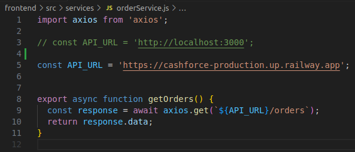

# 💸 Cashforce Challenge

Este projeto é uma aplicação fullstack desenvolvida como parte de um desafio técnico. A proposta consiste em consumir uma base de dados com informações de pedidos (notas fiscais) e exibi-los de forma organizada e responsiva na interface.

---

## 🌐 Deploy Online

- 🔗 **Frontend**: [https://cashforce.vercel.app/](https://cashforce.vercel.app/)
- 🔗 **Backend (API)**: [https://cashforce-production.up.railway.app](https://cashforce-production.up.railway.app)

---

## 🧠 Funcionalidades

### ✅ Backend (Node.js + Express + Sequelize)

- API RESTful para consulta de pedidos (`/orders`)
- Integração com banco de dados MySQL
- Associação entre tabelas (buyers, providers, cnpjs, users)
- Mapeamento de status descritivo (`statusDescription`)
- Documentação da API com Swagger
- Testes com Jest e Supertest
- Cobertura completa dos principais fluxos da API
- CRUD completo de usuários**

### ✅ Frontend (Vue.js + Vite)

- Página principal com listagem de notas fiscais:
  - Número da nota
  - Sacado
  - Cedente
  - Emissão formatada
  - Valor formatado
  - Status do pedido
- Interface responsiva (desktop, tablet, mobile)
- Sidebar com navegação via `vue-router`
- Estilização com Tailwind CSS
- Testes com Vitest + Vue Test Utils
- Alta cobertura dos componentes principais
- Tema claro e tema escuro
- Paginação
- Filtro por nome de usuário
- Gerenciamento de usuários
  - listagem de usuários
  - Criando registro do usuário
  - Atualizando registro do usuário
  - Deletando registro do usuário

---

## 🛠️ Como rodar o projeto localmente

### 1. Clone o repositório

```bash
git clone https://github.com/michael-petterson-06/Cashforce.git
```

---

### 2. Inicie o backend

```bash
cd cashforce-api
yarn install
yarn dev
```

A API estará disponível em `http://localhost:3000`.

---

### 3. Inicie o frontend

```bash
cd cashforce-frontend
yarn install
yarn dev
```

A aplicação estará disponível em `http://localhost:5173`.

---

### ℹ️ Dica para o Recrutador

Caso deseje rodar o projeto localmente, lembre-se de alternar entre o backend local e remoto no seguinte arquivo do Frontend:

```js
// src/services/api.js
```

#### 🔁 Troque esta linha:
```js
const API_URL = 'https://cashforce-production.up.railway.app';
```

#### ✅ Por esta:
```js
const API_URL = 'http://localhost:3000';
```



---

## 🧪 Testes

### Backend

```bash
yarn test:coverage

# ou

test:watch

- Testes com Jest e Supertest
- Testes de `/orders` com verificação de status e mapeamento
- Testes de `/users` com verificação de status e mapeament
- Cobertura alta dos casos de sucesso e falha

#### Rodar testes com cobertura:

```bash
yarn test:coverage

# ou

test:watch
```
### 🧪 Cobertura de Testes


### Frontend

```bash
yarn test:unit

yarn test:unit2 # com coverage

- Testes unitários e de integração
- `OrderRow.vue`, `Home.vue`, `Sidebar.vue`, `BaseRow.vue`, `TransferorDetails.vue`.

```
### 🧪 Cobertura de Testes


---

## 📄 Swagger

A documentação da API está disponível em:

```
http://localhost:3000/api-docs

https://cashforce-production.up.railway.app/api-docs/
```

## 🖼️ Imagens

### 💻 Desktop


### 📱 Tablet


### 📱 Mobile


---

## 📌 Melhorias Futuras

- [ ] Adicionar autenticação
- [ ] Adicionar filtros de data
- [ ] Otimizações de acessibilidade

---

## 🙋‍♂️ Autor

Desenvolvido por **Michael Petterson**  
📫 **E-mail:** michaelpetterson06@gmail.com  
🌐 [Portfólio](https://michael-petterson-06.github.io/portfolio-mike)

---

## 📃 Licença

Este projeto está sob a licença **MIT**.  
Desenvolvido para o desafio técnico da empresa **Cashforce**